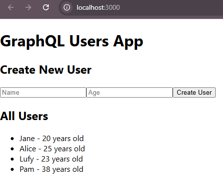

# graphql-react-mongodb-demo

## How to run Application

Run the following commands inside `backend` folder:

- To run the mongoDB service in docker use the following command

```bash
docker-compose up
```

- Next, install the necessary packages and start the server using the followin commands

```bash
npm install
node server.js
```

Change the directory to frontend folder `graphql-users-frontend` and `npm install` to install necessary packages

```bash
cd graphql-users-frontend
npm install
```

Then start the application using the following


```bash
npm start
```

**_NOTE:_**

Make sure you run you backend before tsrting the front end.


---

After running the application frontend looks like the following



---

## Backend

👉 Check the [BACKEND-README.md](/backend/BACKEND-README.md)

## Frontend

👉 Check the [FRONTEND-README.md](/graphql-users-frontend/FRONTEND-README.md)
